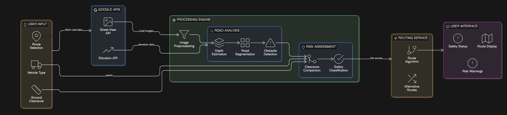

# Efficient-vehicle-Based-Road-System
# 🚗 Ground-Clearance-Aware Navigation System

> A smarter navigation system that recommends the safest road route based on your vehicle's ground clearance — not just the shortest or fastest path.

---

##  What Is This?

When you use Google Maps, it finds the fastest or shortest route. But it has no idea whether that road has deep potholes, broken surfaces, or high speed breakers that could damage the underside of your car.

This project solves that.

By analysing road surface conditions using street-level images and estimating obstacle severity, the system recommends a route that is safest for your vehicle's specific ground clearance — avoiding roads that could cause underbody damage or suspension wear.

---

##  System Architecture

The system is divided into five stages:

**1. User Input**
The user provides three things — their route (source & destination), vehicle type, and ground clearance value.

**2. Google APIs**
- Street View API fetches road-level images for each part of the route.
- Elevation API provides terrain height data.

**3. Processing Engine**
Road images go through a pipeline:
- Images are preprocessed (cleaned and enhanced).
- Depth estimation estimates how deep or tall obstacles appear.
- Road segmentation breaks the image into meaningful zones.
- Obstacle detection identifies potholes and speed breakers.

**4. Risk Assessment**
- The detected obstacles are compared against the vehicle's ground clearance.
- Each road segment is classified as Low, Medium, or High risk.

**5. Routing Service & User Interface**
- A modified routing algorithm finds the safest path using risk scores.
- Alternative routes are also calculated.
- The final map shows the recommended route, risk warnings, and safety status.

---

##  Who Is This For?

- Drivers of low ground-clearance vehicles (sedans, hatchbacks, sports cars)
- Anyone travelling on roads with poor surface conditions
- Commuters who want to protect their vehicle from avoidable damage

---

##  How It Works — In Simple Terms

1. You enter your **start point**, **end point**, and **vehicle type**.
2. The system fetches road images along your route from Google Street View.
3. Each image is analysed to detect obstacles like potholes and speed breakers.
4. A **risk score** is calculated for each road segment based on how dangerous it is for your vehicle.
5. The routing algorithm finds the path with the **lowest combined distance and risk**.
6. You see the safest route on a map, with colour-coded risk highlights.

## 🛠️ Tech Stack

| Purpose | Tool Used |
|---|---|
| Route & map data | Google Maps Directions API |
| Road imagery | Google Street View Static API |
| Obstacle detection | YOLOv8 |
| Depth estimation | MiDaS |
| Routing algorithm | Modified A* (A-Star) |
| Backend | Python, Flask |
| Map visualisation | Folium |

---

## 📄 Documentation

All project documents are in the `docs/` folder:

- [`requirements.md`](docs/requirements.md) — Functional and non-functional requirements, user stories
- [`DESIGN.md`](docs/DESIGN.md) — System design, module design, technology choices
- [`ARCHITECTURE.md`](docs/ARCHITECTURE.md) — Module interaction, data contracts, repo structure

---

##  Known Limitations

- Road images come from Google Street View, which may not always be up to date.
- Depth estimation gives a **relative** measure, not exact millimetre values. Risk is calculated using a normalised depth index.
- The system is **not real-time** — it analyses a route when you query it. Live road updates are planned as future work.

---

##  Future Scope

- Real-time road condition updates using crowdsourced dashcam data
- Mobile app (Android & iOS)
- Larger vehicle database with manufacturer specs
- Support for two-wheelers and electric vehicles

---
